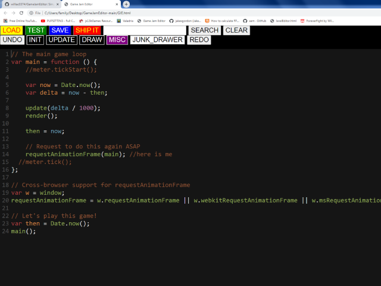

# GameJamEditor
A javascript code editor for making simple Game Jam scale games.

    

This is just a Javascript editor.  There is no included game engine under the hood. It generates just enough html to make it work the way I wanted so you may need to edit the final exported html file to suit your needs.  It uses codeMirror for editing javascript.  The script files are saved in local storage until you export a html file. The test button tests the game by combining the init, update, draw and misc scripts in that order and writing a  temporary html file that runs the code. When the game is done and your ready to export it The "ship it" button exports a html file with the total scripts written inside script tags. The junk_drawer script is not evaluated when testing or included in the exported html file. its there to serve as a scratchpad for pasted code snippets or to-do lists or whatever. The search box is a simple google search that I use constantly since my javascript-fu is pretty weak. The clear button wipes the scripts from memory for a clean slate.  The save button saves whatever script is currently displayed for backup purposes. The load button loads a javascript file to the currently displayed script. The saved scripts and exported html files go straight to whatever download folder your browser uses.
I run this locally in Chromium Version 98.0.4695.0 (Developer Build) (32-bit) on my win7 desktop and on the latest version of mobile Chrome on my android. On my android I run it from chromes internal storage download folder. The zip file needs to be opened in the Internal storage/Android/data/com.android.chrome/files/Download folder. On my phone the mobile chrome url is  "file:///storage/emulated/0/Android/data.com.android.chrome/files/Download/GJE/GJE.html"

Yours may be different.

this was inpired by Bitmelo https://bitmelo.com/ , and more recently EVO game engine https://itch.io/jam/the-tool-jam/rate/1034973 since CodeMirror https://codemirror.net/ feels nicer to work with on my phone than Ace editor https://ace.c9.io/ .  But that could be me not knowing how to use Ace correctly.
