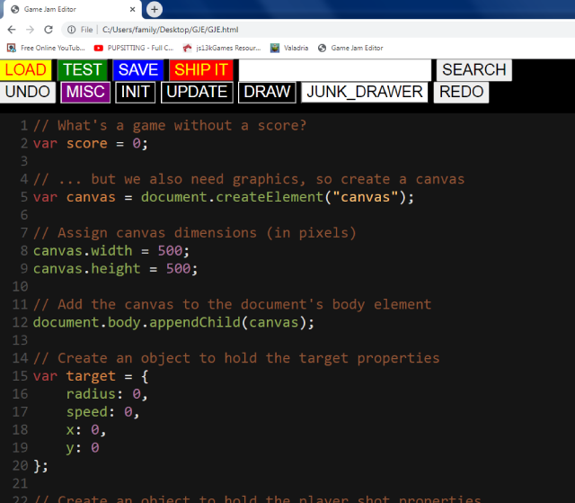

# GameJamEditor
Simple javascript code editor for making simple Game Jam scale games.

    

When testig it works by combining the misc, init, update and draw scripts in that order and writing temporary html file that runs the code.  When the game is done and your ready to export it The ship it button saves a html file with the total scripts written inside script tags.  The junk_draw script is not evaluated when testing or included in the exported html file. its there to serve as a scratchpad for pasted code snippets or to-do lists or whatever.  The search box is a simple google search that I use constantly since my javascript-fu is pretty weak.

I run this locally in Chromium Version 98.0.4695.0 (Developer Build) (32-bit) and on the latest version of mobile Chrome on my android.  On my android I run it from chromes internal storage download folder.
The zip file needs to be opened in the Internal storage/Android/data/com.android.chrome/files/Download  folder.
On my phone the mobile chrome url is then "file:///storage/emulated/0/Android/data.com.android.chrome/files/Download/GJE/GJE.html"

Yours may be different.

